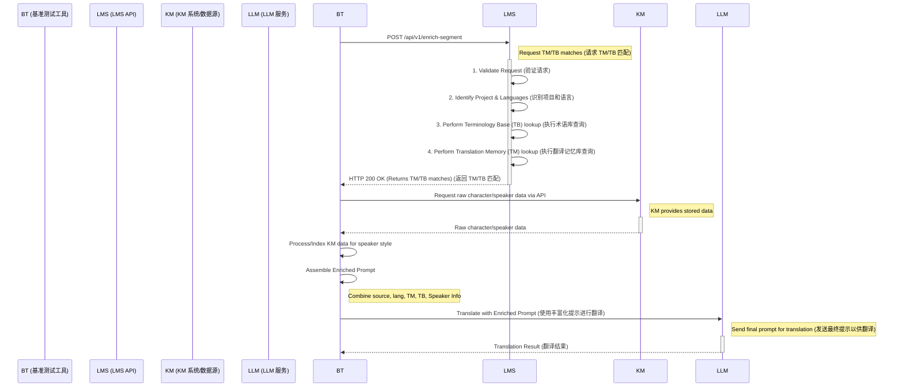

# LMS API Integration Requirements for PromptCraft Benchmark Tool

## 1. Introduction

This document outlines the API requirements for integrating the Localization Management System (LMS) with PromptCraft's Benchmark Tool. The primary goal of this integration is to enable the Benchmark Tool to retrieve relevant Translation Memory (TM) and Terminology Base (TB) matches from LMS for a given source text segment. This information, combined with speaker/character style information retrieved from an internal Knowledge Management (KM) system, will be used to construct more contextually rich and accurate prompts for evaluation with Large Language Models (LLMs) like Claude.

## 2. Background

PromptCraft's Benchmark Tool is designed to evaluate the quality of LLM-generated translations by testing various prompts against test sets. Currently, prompts are assembled based on user-defined structures and the source text. To improve the contextual information provided to the LLM, we need to incorporate:

1.  **TM Matches:** Relevant translations from existing Translation Memories.
2.  **TB Matches:** Approved terminology for consistency.
3.  **Speaker/Character Information:** Details about the speaker's tone, style, and other attributes (as described in `docs/prompt_logic.md` for future prompt enhancements).

This integration focuses on obtaining TM and TB data from LMS. The speaker/character information will be sourced internally by the Benchmark Tool after receiving data from LMS.

## 3. Actors

*   **PromptCraft Benchmark Tool (Client):** The system initiating the request for TM/TB data.
*   **LMS API (Server):** The LMS endpoint providing TM/TB data.
*   **(Internal) KM System:** A separate internal system queried by the Benchmark Tool for speaker style information.
*   **(Internal) LLM (e.g., Claude):** The language model that ultimately processes the assembled prompt.

## 4. Proposed Workflow and Data Flow (提议的工作流程和数据流)

The overall process for enriching a source text segment before sending it to an LLM for translation is as follows:

1.  The **Benchmark Tool** receives a source text segment, its project context, and target language.
2.  The **Benchmark Tool** sends an API request to the **LMS API** with the source text, project identifier, and target language.
3.  The **LMS API** processes the request, performs TM and TB lookups based on the provided parameters.
4.  The **LMS API** returns a list of matched TM entries (with match percentages) and matched TB entries (source and target terms).
5.  The **Benchmark Tool** then queries an internal **KM System** (Knowledge Management system, acting as a data source) via an API to retrieve potentially relevant raw character/speaker data. The Benchmark Tool subsequently processes or indexes this retrieved data to extract specific speaker style information pertinent to the source text (if applicable).
6.  The **Benchmark Tool** assembles a final, enriched prompt using the original source text, target language, the TM/TB data from LMS, and the extracted speaker style info.
7.  This assembled prompt is then sent to an **LLM** for translation.

### Sequence Diagram (Benchmark Tool & LMS API Interaction) (序列图 - 基准测试工具与LMS API交互)

The following diagram details the direct interaction between the PromptCraft Benchmark Tool and the LMS API, as well as subsequent internal steps for prompt assembly:



## 5. API Requirements for LMS (LMS的API需求)

The LMS team is requested to provide an API endpoint with the following specifications:

### 5.1. Endpoint Details

*   **URL Path:** `/api/v1/enrich-segment` (or similar, to be confirmed by LMS team)
*   **HTTP Method:** `POST`
*   **Content-Type:** `application/json`

### 5.2. Request Payload

The request body should be a JSON object with the following fields:

| Field                  | Type   | Required | Description                                                                 | Example                     |
| :--------------------- | :----- | :------- | :-------------------------------------------------------------------------- | :-------------------------- |
| `source_text`          | string | Yes      | The text segment for which TM/TB matches are requested.                     | "Hello, how are you today?" |
| `project_id`           | string | Yes      | The identifier for the project within LMS.                                  | "project_alpha_game"        |
| `target_language_code` | string | Yes      | The target language code (e.g., IETF BCP 47 format).                      | "fr-FR"                     |
| `source_language_code` | string | No       | The source language code. Optional if derivable from `project_id`.        | "en-US"                     |
| `max_tm_results`       | int    | No       | Optional: Maximum number of TM results to return. Defaults to LMS preference. | 5                           |
| `min_tm_match_percent` | float  | No       | Optional: Minimum match percentage for TM results. Defaults to LMS preference. | 75.0                        |
| `max_tb_results`       | int    | No       | Optional: Maximum number of TB results to return. Defaults to LMS preference. | 10                          |

**Example Request Body:**

```json
{
  "source_text": "The quick brown fox jumps over the lazy dog.",
  "project_id": "internal_game_project_x",
  "target_language_code": "de-DE",
  "source_language_code": "en-US",
  "max_tm_results": 3,
  "min_tm_match_percent": 80
}
```

### 5.3. Response Payload (Success - HTTP 200 OK)

The successful response body should be a JSON object with the following structure:

| Field         | Type        | Description                                                                |
| :------------ | :---------- | :------------------------------------------------------------------------- |
| `matched_tms` | Array<TM>   | An array of matched Translation Memory entries. Sorted by relevance/match %. |
| `matched_tbs` | Array<TB>   | An array of matched Terminology Base entries.                            |

#### TM Object Structure:

| Field              | Type   | Description                                      | Example                               |
| :----------------- | :----- | :----------------------------------------------- | :------------------------------------ |
| `source_segment`   | string | The source segment from the TM.                  | "The quick brown fox"                 |
| `target_segment`   | string | The corresponding target segment from the TM.    | "Der schnelle braune Fuchs"           |
| `match_percentage` | float  | The match percentage (0-100).                    | 92.5                                  |
| `origin`           | string | Optional: Identifier for the TM source/database. | "main_project_tm"                   |
| `metadata`         | object | Optional: Any other relevant TM metadata.        | `{"id": "tm_entry_123", "created_by": "user_x"}` |

#### TB Object Structure:

| Field       | Type   | Description                                   | Example                     |
| :---------- | :----- | :-------------------------------------------- | :-------------------------- |
| `source_term` | string | The source term from the TB.                  | "dog"                       |
| `target_term` | string | The corresponding target term from the TB.    | "Hund"                      |
| `domain`      | string | Optional: Domain/category of the term.      | "animals"                   |
| `metadata`  | object | Optional: Any other relevant TB metadata.     | `{"id": "tb_entry_456", "status": "approved"}` |

**Example Success Response Body:**

```json
{
  "matched_tms": [
    {
      "source_segment": "The quick brown fox jumps over the lazy dog.",
      "target_segment": "Der schnelle Braunfuchs springt über den faulen Hund.",
      "match_percentage": 100.0,
      "origin": "project_x_tm_gold",
      "metadata": {"id": "tm_xyz"}
    },
    {
      "source_segment": "The quick brown fox jumps over a lazy dog.",
      "target_segment": "Der schnelle Braunfuchs springt über einen faulen Hund.",
      "match_percentage": 95.0,
      "origin": "general_gaming_tm",
      "metadata": {"id": "tm_abc"}
    }
  ],
  "matched_tbs": [
    {
      "source_term": "fox",
      "target_term": "Fuchs",
      "domain": "animals",
      "metadata": {"id": "tb_111"}
    },
    {
      "source_term": "dog",
      "target_term": "Hund",
      "domain": "animals",
      "metadata": {"id": "tb_222"}
    }
  ]
}
```

If no matches are found, empty arrays should be returned for `matched_tms` and `matched_tbs`.

### 5.4. Error Responses

The API should use standard HTTP status codes for errors.

| Status Code | Reason           | Description                                                                                                   | Response Body Example (JSON)                                          |
| :---------- | :--------------- | :------------------------------------------------------------------------------------------------------------ | :-------------------------------------------------------------------- |
| `400`       | Bad Request      | Invalid request payload (e.g., missing required fields, invalid data types, invalid language code format).    | `{"error": "Invalid request", "details": "Field 'project_id' is required."}` |
| `401`       | Unauthorized     | Authentication failed or missing. (Details of authentication mechanism to be discussed separately).         | `{"error": "Authentication required."}`                                 |
| `403`       | Forbidden        | Authenticated user does not have permission to access the resource or perform the action for the project_id.  | `{"error": "Access denied to project."}`                              |
| `404`       | Not Found        | The specified `project_id` does not exist in LMS.                                                             | `{"error": "Project not found."}`                                       |
| `500`       | Internal Server Error | An unexpected error occurred on the LMS server side.                                                        | `{"error": "An internal server error occurred."}`                       |
| `503`       | Service Unavailable | LMS is temporarily unavailable or overloaded.                                                                 | `{"error": "Service temporarily unavailable."}`                         |


## 6. Authentication

The authentication mechanism for accessing this API endpoint needs to be defined (e.g., API Key in header, OAuth2 token). This will be discussed and agreed upon with the LMS team.

## 7. Performance Considerations

*   The API response time should be optimized, as this call will be part of a sequence for each segment processed by the Benchmark Tool.
*   Consider mechanisms for handling bulk requests in the future, although the initial requirement is for single-segment enrichment.

## 8. Future Considerations (Optional)

*   **Batch Processing:** An endpoint to send multiple segments for enrichment in a single request.
*   **Webhook Callbacks:** For very long processing tasks, an option for LMS to call back to PromptCraft once results are ready (though synchronous is preferred for this use case).

## 9. Contact

Please direct questions or clarifications regarding these requirements to the PromptCraft development team. 