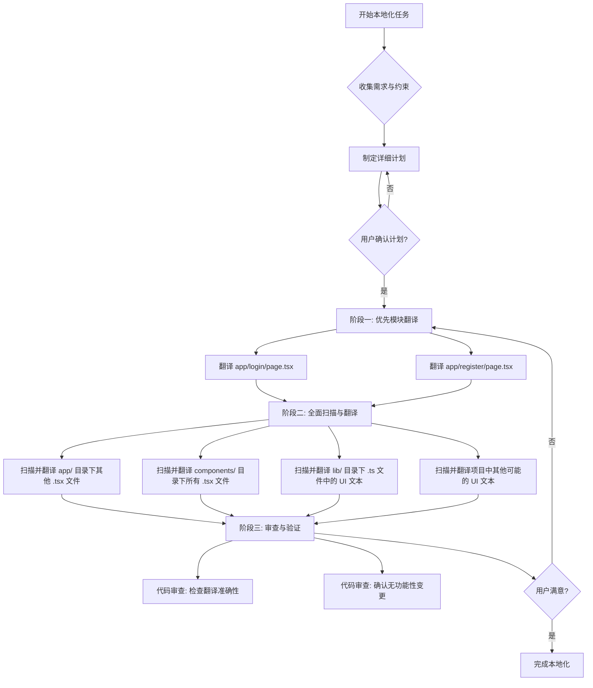

# 本地化计划：UI 文本直接翻译 (简体中文)

**1. 核心目标与原则：**

*   **目标**：将应用程序中所有面向用户的 UI 文本直接在源代码中翻译成简体中文。
*   **核心原则**：
    *   **不引入 i18n 框架**：所有翻译直接在代码中硬编码。
    *   **功能不变**：严格避免任何可能影响现有程序逻辑或功能的改动。
    *   **仅翻译用户可见文本**：非 UI 文本（如注释、日志、内部 ID）保持不变。
    *   **简洁翻译风格**：采用通用、标准的简体中文表达。

**2. 不翻译的内容（黑名单）：**

*   **特定文件**：[`app/core/prompt_templates.py`](app/core/prompt_templates.py)
*   **特定字符串**：
    *   品牌名称："PromptCraft"
    *   所有用作代码内部 `key` 或 `ID` 的字符串。
    *   代码注释 (e.g., `// comment`, `/* comment */`)。
    *   `console.log()` 或其他日志输出中的文本。
    *   主要供开发者使用的、非用户导向的技术性错误信息。
    *   HTML/JSX 属性名 (e.g., `className`, `onClick`)。
    *   CSS 类名。
    *   变量名、函数名、模块名等代码标识符。

**3. 翻译范围与优先级：**

*   **高优先级模块 (首批翻译)**：
    1.  登录页面: [`app/login/page.tsx`](app/login/page.tsx)
    2.  注册页面: [`app/register/page.tsx`](app/register/page.tsx)
*   **主要扫描目录 (针对 `.tsx` / `.ts` 文件)**：
    *   `app/` (所有子目录和文件)
    *   `components/` (所有子目录和文件)
    *   `lib/` (例如 [`lib/utils.ts`](lib/utils.ts), [`lib/types.ts`](lib/types.ts), [`lib/constants.ts`](lib/constants.ts) 等)
*   **其他潜在区域**：根据项目结构，检查其他可能包含用户可见文本的目录或文件。

**4. 执行步骤与策略：**

**详细步骤说明：**

*   **阶段〇：准备工作 (当前阶段已完成)**
    *   与您确认需求、范围、优先级和不翻译的内容。

*   **阶段一：优先模块翻译**
    1.  **目标**：完成 [`app/login/page.tsx`](app/login/page.tsx) 和 [`app/register/page.tsx`](app/register/page.tsx) 中所有用户可见文本的翻译。
    2.  **方法**：
        *   逐个打开文件。
        *   识别 JSX 中的字符串字面量 (e.g., `<h1>Login Page</h1>`, `<Button>Submit</Button>`, `placeholder="Enter your email"`).
        *   识别传递给组件 `props` 的文本 (e.g., `label="Username"`, `tooltip="Click here for help"`).
        *   将识别出的英文文本直接替换为简洁、标准的简体中文翻译。
        *   **注意**：对于 `placeholder` 或表单标签，确保翻译后的文本清晰指导用户。对于按钮文本，确保动词准确。

*   **阶段二：全面扫描与翻译**
    1.  **目标**：系统性地检查并翻译项目中所有剩余的用户可见文本。
    2.  **方法 (针对每个目标目录/文件类型)**：
        *   **`app/` 和 `components/` 目录下的 `.tsx` 文件**：
            *   遍历所有子目录和文件。
            *   采用与阶段一相同的方法识别和翻译 UI 文本。
            *   特别关注：导航栏、页头、页脚、各种面板、模态框、提示信息、表单元素、列表项等。
        *   **`lib/` 目录下的 `.ts` 文件 (及其他相关文件)**：
            *   检查导出的常量字符串、错误消息（如果是用户可见的）、在工具函数中生成的动态文本等。
            *   例如，如果存在 `const GREETING = "Hello";` 并且这个 `GREETING` 在 UI 中显示，则需要翻译。
        *   **其他潜在区域**：根据对项目结构的理解，主动寻找其他可能包含 UI 文本的地方。

*   **阶段三：审查与验证**
    1.  **目标**：确保翻译质量和功能完整性。
    2.  **方法**：
        *   **翻译准确性审查**：通读所有已翻译的文本，检查是否有错译、漏译、或表达不自然的地方。
        *   **功能完整性审查**：仔细对比修改前后的代码（如果可能），确保除了字符串替换外，没有其他逻辑上的改动。特别注意条件渲染、动态文本生成等地方，确保翻译没有破坏其逻辑。
        *   **一致性检查**：确保相同或相似的术语在整个应用中翻译一致。

**5. 关键注意事项：**

*   **逐文件处理**：建议一次专注于一个文件或一个小模块的翻译，以降低复杂度和出错风险。
*   **版本控制**：强烈建议在开始翻译前及每个阶段完成后，使用 Git 等版本控制工具提交代码，方便回溯。
*   **测试**：在翻译完成后，进行基本的功能测试，确保页面能正常显示，交互无异常。
*   **动态文本**：如果文本是动态生成的 (e.g., `"You have " + count + " messages."`)，需要翻译静态部分，并确保动态部分 (变量 `count`) 的拼接逻辑不受影响 (e.g., `"您有 " + count + " 条消息。"`).
*   **复数形式**：英文中名词的复数形式 (e.g., message/messages) 在中文中通常不需要特殊处理，但需注意语境。
*   **占位符和插值**：对于包含占位符的字符串 (e.g., `Hello, {username}!`)，只翻译文本部分，保持占位符不变 (e.g., `你好，{username}！`)。